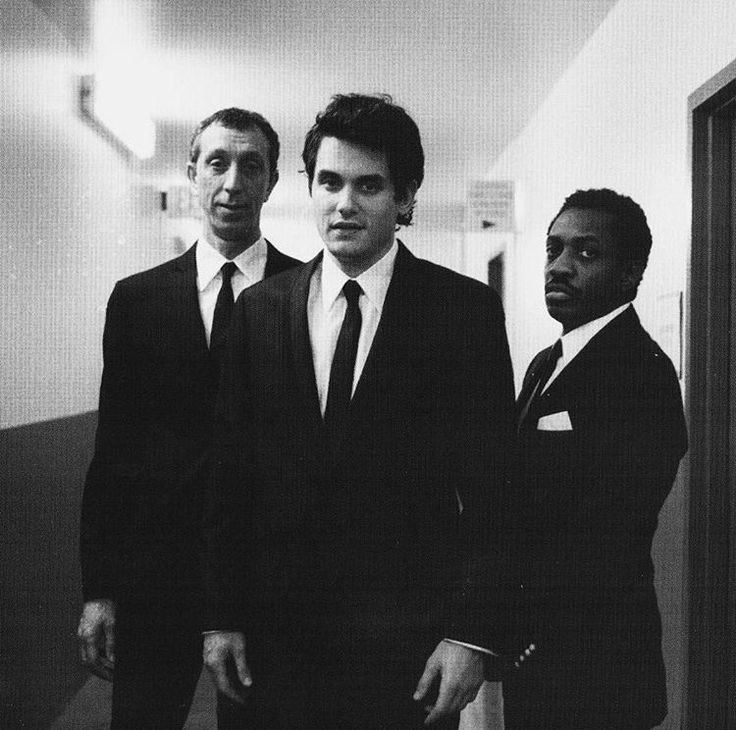
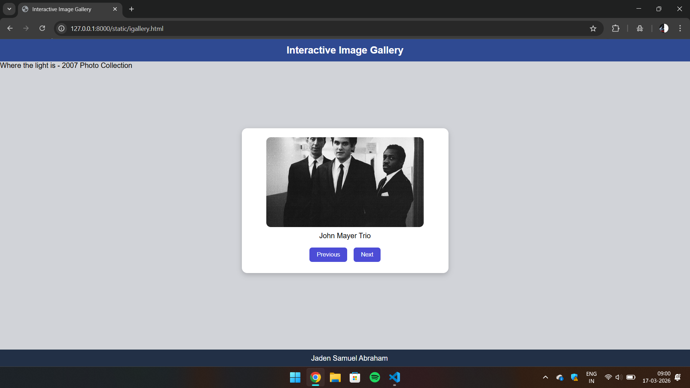

# Ex.07 Design of Interactive Image Gallery
## Date: 17/03/26

## AIM:
To design a web application for an inteactive image gallery for a minimum five images with next and previous buttons.

## DESIGN STEPS:

### Step 1:
Clone the github repository and create Django admin interface.

### Step 2:
Change settings.py file to allow request from all hosts.

### Step 3:
Use CSS for positioning and styling.

### Step 4:
Write JavaScript program for implementing interactivity.

### Step 5:
Validate the HTML and CSS code.

### Step 6:
Publish the website in the given URL.

## PROGRAM:
```
html

<html>
<head>
<title>Interactive Image Gallery</title>
<link rel="stylesheet" href="igallery.css">
</head>

<body>

<div class="header-bar">
Interactive Image Gallery
</div>
Where the light is - 2007 Photo Collection
<div class="content-area">

<div class="image-box">



<div id="text" class="image-caption"></div>

<div class="controls">
<button onclick="previous()">Previous</button>
<button onclick="next()">Next</button>
</div>

</div>

</div>

<div class="footer-bar">
Jaden Samuel Abraham
</div>

<script src="igallery.js"></script>

</body>
</html>

javascript

const images = [
{src:"J1.jpeg", text:"John Mayer Trio"},
{src:"J2.jpeg", text:"Backstage"},
{src:"J3.jpeg", text:"Heart of life hollywood"},
{src:"J4.jpeg", text:"Everyday I have the blues"},
{src:"J5.jpeg", text:"Stop This Train"},
{src:"J6.jpeg", text:"Neon"}
];

let current = 0;

function showImage(){
document.getElementById("photo").src = images[current].src;
document.getElementById("text").innerHTML = images[current].text;
}

function next(){
current++;
if(current >= images.length){
current = 0;
}
showImage();
}

function previous(){
current--;
if(current < 0){
current = images.length - 1;
}
showImage();
}

showImage();

css

body{
margin:0;
font-family:Arial;
background:#d1d3d8;
}

.header-bar{
background:#2f4a92;
color:white;
text-align:center;
padding:12px;
font-size:22px;
font-weight:bold;
}

.content-area{
display:flex;
justify-content:center;
align-items:center;
height:80vh;
}

.image-box{
background:white;
padding:20px;
border-radius:12px;
text-align:center;
width:420px;
box-shadow:0px 4px 12px rgba(0,0,0,0.2);
}

.display-img{
width:350px;
height:200px;
border-radius:10px;
object-fit:cover;
}

.image-caption{
margin-top:10px;
font-size:16px;
}

.controls{
margin-top:12px;
}

button{
background:#4c4cd6;
color:white;
border:none;
padding:8px 16px;
margin:5px;
border-radius:6px;
cursor:pointer;
}

button:hover{
background:#3a3ab0;
}

.footer-bar{
background:#223046;
color:white;
text-align:center;
padding:10px;
position:fixed;
bottom:0;
width:100%;
}
```
## OUTPUT:

## RESULT:
The program for designing an interactive image gallery using HTML, CSS and JavaScript is executed successfully.
